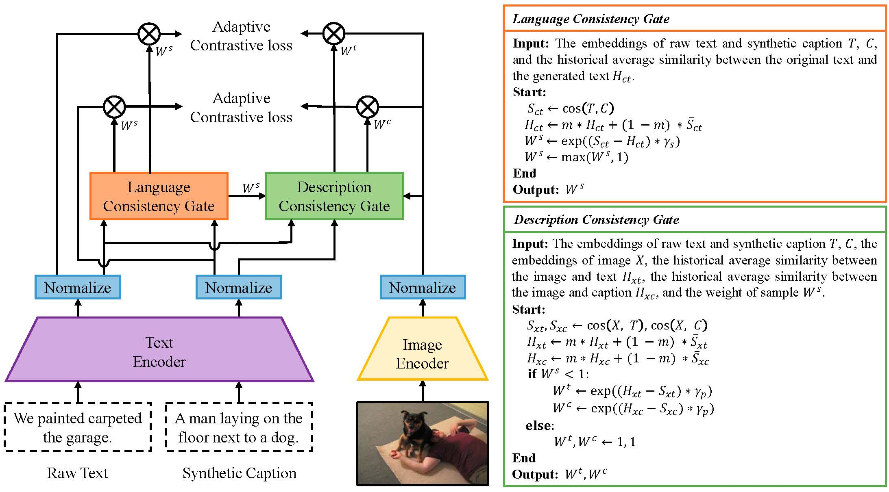

<div align="center">

# 【ICCV2023】[ALIP: Adaptive Language-Image Pre-training with Synthetic Caption](https://arxiv.org/abs/2308.08428) 

Author: Kaicheng Yang, Jiankang Deng, Xiang An, Jiawei Li, Ziyong Feng, Jia Guo, Jing Yang, Tongliang Liu


[](https://arxiv.org/abs/2308.08428)  [](https://iccv2023.thecvf.com) 

</div>

## Introduction
 Adaptive Language-Image Pre-training (ALIP) is a bi-path model that integrates supervision from both raw text and synthetic caption. As the core components of ALIP, the Language Consistency Gate (LCG) and Description Consistency Gate (DCG) dynamically adjust the weights of samples and image-text/caption pairs during the training process. Meanwhile, the adaptive contrastive loss can effectively reduce the impact of noise data and enhances the efficiency of pre-training data.


## 📣 News
- **_(2023.8.15)_**: ✨Code has been released❗️
- **_(2023.7.14)_**: ✨Our paper is accepted to ICCV2023❗️

## Instructions
- ### Environment installation

    ```
    pip install -r requirments.txt
    ```
- ### Dataset preparation
    
    1、Download YFCC15M

    The YFCC15M dataset we used is [YFCC15M-DeCLIP](https://arxiv.org/abs/2110.05208), we download it from the [repo](https://github.com/AdamRain/YFCC15M_downloader), finally we successful donwload 15061515 image-text pairs.

    2、Generate synthetic caption

    In our paper, we use OFA model to generate synthetic captions. You can download model weight and scripts from the [OFA](https://github.com/OFA-Sys/OFA) project.

    3、Generate rec files

    To improve the training efficience, we use [MXNet](https://github.com/apache/mxnet) to save the YFCC15M dataset to rec file, and use NVIDIA [DALI](https://github.com/NVIDIA/DALI) to accelerate data loading and pre-processing. The sample code to generate rec files is in [data2rec.py](data2rec.py).

- ### Pretrained Model Weight

    You can download the pretrained model weight from [Google Drive](https://drive.google.com/file/d/1AqSHisCKZOZ16Q3sYguK6zIZIuwwEriE/view?usp=share_link) or [BaiduYun](https://pan.baidu.com/s/10dFfvGMWeaTXUyrZlZlCEw?pwd=xftg), and you can find the traning log in [Google Drive](https://drive.google.com/file/d/1I8gdSQCJAfFamDcVztwW8EQIc_OOK8Xh/view?usp=share_link) or [BaiduYun](https://pan.baidu.com/s/1oz0UVzX2N0Sri7MfwR-kog?pwd=7ki7)

- ### Training

    Start training by run
    ```
    bash scripts/train_yfcc15m_B32_ALIP.sh
    ```

- ### Evaluation

    Evaluate zero shot cross-modal retireval

    ```
    bash run_retrieval.sh
    ```
    Evaluate zero shot classification

    ```
    bash run_zeroshot.sh
    ```

- ### Results
    ### zero shot cross modal retrieval 
    <table><tbody>
    <!-- START TABLE -->
    <!-- TABLE HEADER -->
    <th valign="center">Method</th>
    <th valign="center">Model</th>
    <th valign="center">MSCOCO R@1</th>
    <th valign="center">MSCOCO R@5 </th>
    <th valign="center">MSCOCO R@10 </th>
    <th valign="center">Flickr30k R@1</th>
    <th valign="center">Flickr30k R@5</th>
    <th valign="center">Flickr30k R@10</th>

    <!-- TABLE BODY -->
    <tr>
    <td align="center">CLIP</td>
    <td align="center">B/32</td>
    <td align="center">20.8/13.0</td>
    <td align="center">43.9/31.7</td>
    <td align="center">55.7/42.7</td>
    <td align="center">34.9/23.4</td>
    <td align="center">63.9/47.2</td>
    <td align="center">75.9/58.9</td>
    </tr>
    <tr>
    <td align="center">SLIP</td>
    <td align="center">B/32</td>
    <td align="center">27.7/18.2</td>
    <td align="center">52.6/39.2</td>
    <td align="center">63.9/51.0</td>
    <td align="center">47.8/32.3</td>
    <td align="center">76.5/58.7</td>
    <td align="center">85.9/68.8</td>
    </tr>
    <tr>
    <td align="center">DeCLIP</td>
    <td align="center">B/32</td>
    <td align="center">28.3/18.4</td>
    <td align="center">53.2/39.6</td>
    <td align="center">64.5/51.4</td>
    <td align="center">51.4/34.3</td>
    <td align="center">80.2/60.3</td>
    <td align="center">88.9/70.7</td>
    </tr>
    <tr>
    <td align="center">UniCLIP</td>
    <td align="center">B32</td>
    <td align="center">32.0/20.2</td>
    <td align="center">57.7/43.2</td>
    <td align="center">69.2/54.4</td>
    <td align="center">52.3/34.8</td>
    <td align="center">81.6/62.0</td>
    <td align="center">89.0/72.0</td>
    </tr>
    <tr>
    <td align="center">HiCLIP</td>
    <td align="center">B/32</td>
    <td align="center">34.2/20.6</td>
    <td align="center">60.3/43.8</td>
    <td align="center">70.9/55.3</td>
    <td align="center">——</td>
    <td align="center">——</td>
    <td align="center">——</td>
    </tr>
    <tr>
    <td align="center">HiDeCLIP</td>
    <td align="center">B/32</td>
    <td align="center">38.7/23.9</td>
    <td align="center">64.4/48.2</td>
    <td align="center">74.8/60.1</td>
    <td align="center">——</td>
    <td align="center">——</td>
    <td align="center">——</td>
    </tr>
    <tr>
    <td align="center">ALIP</td>
    <td align="center">B/32</td>
    <td align="center">46.8/29.3</td>
    <td align="center">72.4/54.4</td>
    <td align="center">81.8/65.4</td>
    <td align="center">70.5/48.9</td>
    <td align="center">91.9/75.1</td>
    <td align="center">95.7/82.9</td>
    </tr>
    
    </tbody></table>


    ### zero shot classification 
    <table><tbody>
    <!-- START TABLE -->
    <!-- TABLE HEADER -->
    <th valign="center">Method</th>
    <th valign="center">Model</th>
    <th valign="center">CIFAR10</th>
    <th valign="center">CIFAR100</th>
    <th valign="center">Food101</th>
    <th valign="center">Pets</th>
    <th valign="center">Flowers</th>
    <th valign="center">SUN397</th>
    <th valign="center">Cars</th>
    <th valign="center">DTD</th>
    <th valign="center">Caltech101</th>
    <th valign="center">Aircraft</th>
    <th valign="center">Imagenet</th>
    <th valign="center">Average</th>

    <!-- TABLE BODY -->
    <tr>
    <td align="center">CLIP</td>
    <td align="center">B/32</td>
    <td align="center">63.7</td>
    <td align="center">33.2</td>
    <td align="center">34.6</td>
    <td align="center">20.1</td>
    <td align="center">50.1</td>
    <td align="center">35.7</td>
    <td align="center">2.6</td>
    <td align="center">15.5</td>
    <td align="center">59.9</td>
    <td align="center">1.2</td>
    <td align="center">32.8</td>
    <td align="center">31.8</td>
    </tr>
    <tr>
    <td align="center">SLIP</td>
    <td align="center">B/32</td>
    <td align="center">50.7</td>
    <td align="center">25.5</td>
    <td align="center">33.3</td>
    <td align="center">23.5</td>
    <td align="center">49.0</td>
    <td align="center">34.7</td>
    <td align="center">2.8</td>
    <td align="center">14.4</td>
    <td align="center">59.9</td>
    <td align="center">1.7</td>
    <td align="center">34.3</td>
    <td align="center">30.0</td>
    </tr>
    <tr>
    <td align="center">FILIP</td>
    <td align="center">B/32</td>
    <td align="center">65.5</td>
    <td align="center">33.5</td>
    <td align="center">43.1</td>
    <td align="center">24.1</td>
    <td align="center">52.7</td>
    <td align="center">50.7</td>
    <td align="center">3.3</td>
    <td align="center">24.3</td>
    <td align="center">68.8</td>
    <td align="center">3.2</td>
    <td align="center">39.5</td>
    <td align="center">37.2</td>
    </tr>
    <tr>
    <td align="center">DeCLIP</td>
    <td align="center">B/32</td>
    <td align="center">66.7</td>
    <td align="center">38.7</td>
    <td align="center">52.5</td>
    <td align="center">33.8</td>
    <td align="center">60.8</td>
    <td align="center">50.3</td>
    <td align="center">3.8</td>
    <td align="center">27.7</td>
    <td align="center">74.7</td>
    <td align="center">2.1</td>
    <td align="center">43.2</td>
    <td align="center">41.3</td>
    </tr>
    <tr>
    <td align="center">DeFILIP</td>
    <td align="center">B/32</td>
    <td align="center">70.1</td>
    <td align="center">46.8</td>
    <td align="center">54.5</td>
    <td align="center">40.3</td>
    <td align="center">63.7</td>
    <td align="center">52.4</td>
    <td align="center">4.6</td>
    <td align="center">30.2</td>
    <td align="center">75.0</td>
    <td align="center">3.3</td>
    <td align="center">45.0</td>
    <td align="center">44.2</td>
    </tr>
    <tr>
    <td align="center">HiCLIP</td>
    <td align="center">B/32</td>
    <td align="center">74.1</td>
    <td align="center">46.0</td>
    <td align="center">51.2</td>
    <td align="center">37.8</td>
    <td align="center">60.9</td>
    <td align="center">50.6</td>
    <td align="center">4.5</td>
    <td align="center">23.1</td>
    <td align="center">67.4</td>
    <td align="center">3.6</td>
    <td align="center">40.5</td>
    <td align="center">41.8</td>
    </tr>
    <tr>
    <td align="center">HiDeCLIP</td>
    <td align="center">B/32</td>
    <td align="center">65.1</td>
    <td align="center">39.4</td>
    <td align="center">56.3</td>
    <td align="center">43.6</td>
    <td align="center">64.1</td>
    <td align="center">55.4</td>
    <td align="center">5.4</td>
    <td align="center">34.0</td>
    <td align="center">77.0</td>
    <td align="center">4.6</td>
    <td align="center">45.9</td>
    <td align="center">44.6</td>
    </tr>
    <tr>
    <td align="center">ALIP</td>
    <td align="center">B/32</td>
    <td align="center">83.8</td>
    <td align="center">51.9</td>
    <td align="center">45.4</td>
    <td align="center">30.7</td>
    <td align="center">54.8</td>
    <td align="center">47.8</td>
    <td align="center">3.4</td>
    <td align="center">23.2</td>
    <td align="center">74.1</td>
    <td align="center">2.7</td>
    <td align="center">40.3</td>
    <td align="center">41.7</td>
    </tr>
    </tbody></table>


## Acknowledgement

This project is based on [open_clip](https://github.com/mlfoundations/open_clip) and [OFA](https://github.com/OFA-Sys/OFA), thanks for their works.

## License

This project is released under the MIT license. Please see the [LICENSE](LICENSE) file for more information.

## Citation
If you find this repository useful, please use the following BibTeX entry for citation.

```latex
@misc{yang2023alip,
      title={ALIP: Adaptive Language-Image Pre-training with Synthetic Caption}, 
      author={Kaicheng Yang and Jiankang Deng and Xiang An and Jiawei Li and Ziyong Feng and Jia Guo and Jing Yang and Tongliang Liu},
      year={2023},
      eprint={2308.08428},
      archivePrefix={arXiv},
      primaryClass={cs.CV}
}
```

## 🌟Star History

[](https://star-history.com/#deepglint/ALIP&Date)

